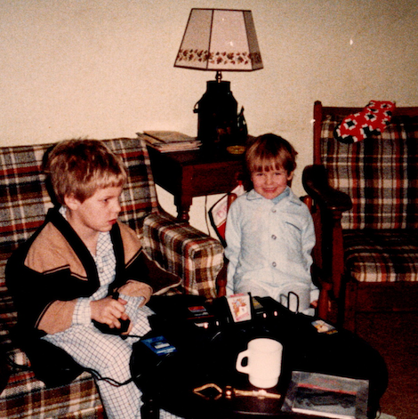
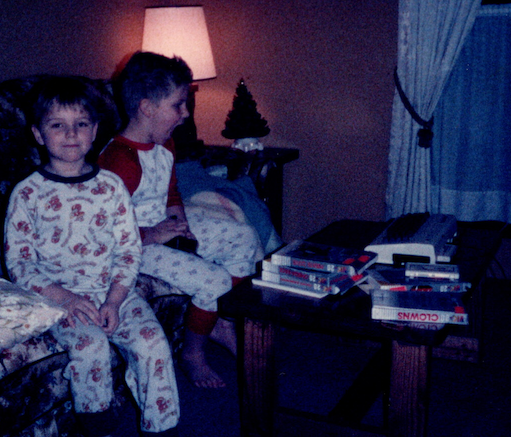
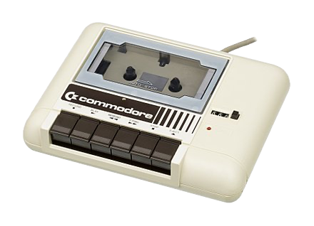
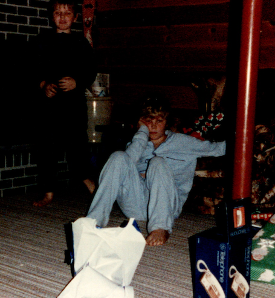
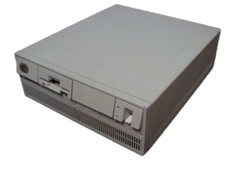
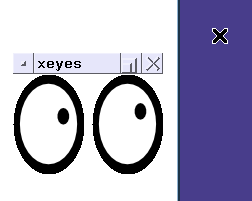
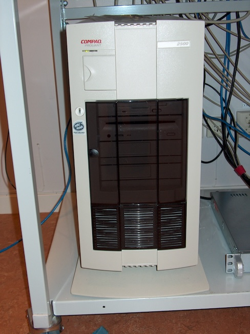
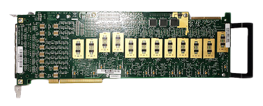
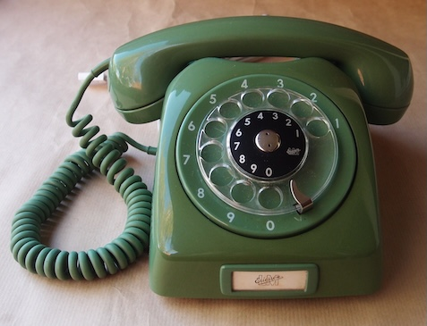

# The Mostly Technological History of Ben Young

## Winter 1983 — My love affair with technology

I first fell in love with computers when a friend of my parents brought their copy of [Star Raiders](https://en.wikipedia.org/wiki/Star_Raiders) and a CX-21 controller to our house in Poland, NY. I had just turned six and was completely taken with the idea of having more responsibility and control over our Atari-2600 beyond the simple spinner/joystick and button. Don’t get me wrong—playing Pong with my little brother (and occasionally hip‑checking him to throw him off) was fun, but it quickly became boring because there was only one input and one output to think about. After waiting what felt like days (about 30 minutes) for my dad and his friend Mike to finish playing, I was handed the controller. My life was forever changed.

I was terrible in that first Star Raiders session, but I loved the challenge. My love of gaming continued: from playing Rouge on a TRS-80 in the dank basement of the Poland library to tackling absurdly hard settings in strategy, role‑playing, and simulation games like Ultima I–VIII, Civilization I–VI, SimCity I–IV, The Sims I–IV, Zelda, and many more. When I found solutions on higher difficulty settings, I kept cranking them up until they couldn’t go any higher. I loved the problems those games presented, and that is why I ultimately chose software engineering as a career — it, too, offers infinitely scalable challenges :)

## Spring 1985 — A foray into programming

Almost two years after my first Star Raiders session, my mom bought a VIC-20 for a data-entry class. My brother and I dove into games like Tooth Invaders, Pirates Cove, and Voodoo Castle, but the VIC-20 offered something more: BASIC programming. Not only could we play games, we could write our own. It started with old‑school copy‑and‑paste programs from paper sources like *[COMPUTE!](https://en.wikipedia.org/wiki/Compute!)* and a programming book that included an 8,000‑line Star Trek program. Debugging that program tested an eight‑year‑old’s patience and nearly resulted in the physical destruction of our VIC-20.

My brother and I modified games and wrote simple ones, plus a random‑number generator for our tabletop gaming. But the VIC-20’s tiny internal memory forced us to use external storage.

Our first external media was a tape drive. You had to note the tape counter position for your program’s start and end, run a command to load/save, and press a button to record and stop. Primitive, but better than punch cards.

## Winter 1987 — Games: the gateway drug to software engineering

Our gaming and programming evolved again when we got a Tandy 1000‑HX for Christmas 1987. This machine was a huge step forward: a 3.5" floppy drive, an Intel 8088‑2 at 7 MHz, 256 KB RAM, and games like Space Quest, King’s Quest, and Ultima. For the first time we also encountered the C programming language, DOS 2.11 and Windows 2.02.

The floppy drive made saving programs much easier than indexing cassette tapes on the VIC-20. That encouraged more use of the computer for word processing, gaming, and programming -- turning the machine off no longer meant losing all our work!

Using Turbo C, my brother and I wrote text‑based applications and ASCII‑art games to practice compiling, debugging, and my all-time favorite -- memory management. While sharpening those skills, we quickly became fascinated by a new piece of tech: the internet.

For the first time, my brother and I could connect to BBSes to play online games, publish code, collaborate with others, and cause the trouble only two geeky teens with a modem could. The game of choice was [Space Empire Elite](https://breakintochat.com/wiki/Space_Empire_Elite): 20 turns per day to build your empire and compete for the highest score. It was addictive despite the ASCII art and limited turns.

## Winter 1988 — The highest highs and the lowest lows

My parents can be pranksters. Christmas 1988 was no exception and ranks as their biggest prank. Nintendo was overtaking the home console market and everyone seemed to expect one under the tree. Stores were selling out, and the multi‑month lead up to Christmas looked bleak for Paul and me.

When we left our rooms to see what was under the tree, there was a perfectly sized and weight‑appropriate box that our parents instructed us to open last. We were hopeful—until we opened it and found a new jacket for Paul and a dictionary for me. WTF!!! A FSCKing dictionary!

The picture above does not do my true feelings' justice -- I was furious. Why make us open that gift last? Why tease us with hope? After what felt like an eon of torture, my mom pointed us to a small envelope hidden in the tree that we had missed. Inside was a note: "Look under the blanket in the office." Skeptical, I slowly sulked down the hallway as Paul raced ahead with his optimism. I actually didn’t believe it until we opened the box and set it up. My mood improved considerably once the console was running.

Lessons? Patience is a virtue. Good things come to those who wait. Or maybe I was just being an 11‑year‑old asshole kid and needed to be put in my place. Either way, the Nintendo provided years of fun, though it lacked the connectedness and freedom of the Tandy.

## Summer 1991 — Mowing laws for new tech

I was industrious as a child. By the summer of 1991 I had a lawn‑mowing "empire" (15+ clients) that produced enough income to buy three Nintendo games every week. That summer I decided to save my mowing income to buy, as a 13‑year‑old, our family’s first x86 computer: an IBM PS/2 Model 70 with an i486 25 MHz processor, 2 MB RAM, dual 1.44 MB floppy drives, and—for the first time ever—a 60 MB hard drive. Over time we added a CD‑ROM drive, 14.4K/28.8K modems, more RAM, and a big box fan to overclock it.

I considered this our first "complete" computer, with a modern OS (DOS 6.2/Windows 3.1) and all the hardware you’d expect from modern desktop. It was also the first time we experimented with technologies beyond C.

<!---
TBD: Future content ideas
 - Add more about how we used the PS/2.
 - Learn C in 21 Days book
 - AOL shenanigans and the evolution of the internet
--->

## Fall 1994

I was outside kicking a ball when my friend [Marty](https://www2.ccs.neu.edu/research/gpc/vona.html) invited me over to check out something he’d discovered. On his monitor I saw, for the first time, a non‑DOS/Windows operating system with Xeyes staring back at me.

After Marty explained what I was seeing was a new operating system, I asked the predictable teen question: "So what games can it play?" He laughed and said it was more about the freedom to do whatever you wanted with the OS and extend it however you liked. He then fired up [Wine](https://en.wikipedia.org/wiki/Wine_(software)) and played [Doom](https://en.wikipedia.org/wiki/Doom_(1993_video_game)) on it. Satisfied, I grabbed a floppy copy of Linux and some basic instructions for setting up a dual‑boot system.

This was a major fork in my technology journey. From that day on I always had a machine that could dual‑boot Windows and Linux. Linux opened up a world for my brother Paul and I: networking, kernel development, file systems, databases, web servers—basically every layer from hardware and BIOS to machine code and assembly. This was the point we moved from programmers to software/system engineers. We no longer wrote code only to solve isolated problems; we built systems and shared functionality with the world through a [LAMP](https://en.wikipedia.org/wiki/LAMP_(software_bundle))‑style stack.

Marty was that brilliant friend who always pushed boundaries. I will be forever grateful for his invite to experience Linux for the first time. Thank you, Marty!

<!---
TBD: Future content ideas
 - Windows NT 4.0 -- The best Windows OS ever
--->

## Summer 1997 - A taste of the real world

On the corner of the only intersection in a small town sat an old bank that had been converted into an office and hosting facility. This would be the location for what would become my first paid job as a software engineer. It was so thrilling to be working with others to achieve a common goal. The systems we developed took phone calls from patients and doctors to be used in the analysis of clinical trials. In 1997 we had to accommodate the original internet thin client – a phone!

I loved setting up a new server with linux, installing honking big T1 telephony and voice processing boards, crimping the cables, plugging them in, configuring the database, setting up the schema, and installing all the software we wrote to put the whole system together.  Calling in and watching the database get filled up with data felt magical to me. The system could even do voice recognition to accommodate patients that only had a rotary phone!

[^1]

This job was also my first encounter with a Unix Greybeard and boss for the nest 12 years of my life -- David Quinn-Jacobs (DQJ).

- Guitar playing hippie ✅
- Magnificent gray beard ✅
- Mastery of all things Unix, C, and Lisp ✅

In future sections I'll expand on how he influenced me and my career.

<!---
TBD: Future content ideas
- Expand on Paul/PAR-Tech/Solaris/SUN/Spark
- Big M Supermarket
- High speed Internet (first day for senior year in 1999)
- Java 1.0 for my first class in fall 1996
--->

## Spring 2000 — Theory meets the real world

Graduation! I finally learned the names for all the things I’d been doing as an intern for the previous three summers—and now I had a piece of paper to prove it. Big‑O notation, entity‑relationship diagrams, systems engineering, digital signal processing, and more programming languages than you can shake a stick at. A minor in human communications and a BA in math rounded out my degree in computer and information sciences.

I graduated on a Sunday and started my first full‑time job the next day in Ithaca, NY, with the company where I’d interned for three years. Once again, the office was on the second floor of a bank building at the town’s main intersection. Seriously—what is it with all the banks?

The company was tiny—four people—so my responsibilities extended well beyond engineering: client relations, sales, customer service, audit facilitation, database and systems administration, network administration, SOP writing, and yes, making the coffee. Wearing those hats gave me a deeper understanding of how a business operates across all its functions.

Technically, we iterated on several LAMP stacks to design, operate, gather, and analyze data for clinical trials. Side projects included a LAMP stack for NYSERNet to manage state network grants and some government work for message parsing related to smuggling in the Caribbean. Maybe I shouldn’t have written that last one.

To be continued :rocket:

<!---
TBD: Future content ideas
- Obsession with Dell servers
- Introduce and expand on CJTN
- TMDA -- the war on SPAM
- Getting half-pay
- .com bubble
- etrials acquisition
- Rick P., Ian S. and Joe D.
--->

[^1]: By Diamondmagna - Own work, CC BY-SA 3.0, https://commons.wikimedia.org/w/index.php?curid=20423874
