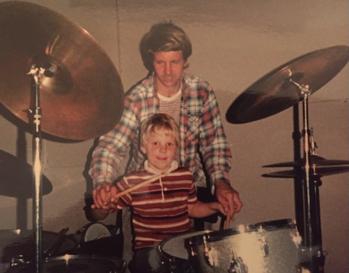

# Personal Information

- Contact email address: Ben@YoungAmores.com
- GitHub: https://github.com/byoung/me
- 

## Principles and Likes/Dislikes

### Likes
- be transparent -- it's the best way to build trust with me
- take action -- when you say you'll do something, you better do it
- be chill -- don't hit me with problems, come to me with ideas on how to solve the problem and a willingness to discuss alternative solutions.

### Dislikes
- Giving me a compliment I did not fight hard to earn
- Not following through
- Talking just to hear yourself talk or to pump yourself up. Shameless self-promotion makes me want to 🤮. Don't tell me how amazing you are -- PROVE IT!
- Bad :car: drivers

## Favorite Quotes

"Not everything that can be counted counts, and not everything that counts can be counted"
-- Albert Einstein

"There are three kinds of lies: Lies, damned lies, and statistics" 
-- Mark Twain

"A place for everything and everything in its place" 
-- Benjamin Franklin

## Hobbies

### Cycling

I love the speed and freedom of cycling. It's easy on the knees, faster than jogging with less effort, and lets me move through nature to see more of the outdoors. Cycling makes me feel free every time I hit the road.

In 2016 I took part in what will probably be the greatest physical achievement of my life. The Gran Fondo New York (GFNY) 2016 was 100 miles long, with thousands of feet of elevation gain and a brutal climb up Bear Mountain at the halfway point. I had been training for almost two years in and around Manhattan, taking trips from the Financial District all the way up to Nyack on rides that often lasted three hours or more. In the weeks leading up to the race two major events happened: I met the love of my life (now wife), Elsa, and my father lost his multi-year battle with Cancer. I was devastated and considered postponing the race, but with encouragement from Elsa—despite her thinking I was a little crazy for attempting 100 miles—I decided to forge ahead and carry my dad not only in my heart but also on my shoulders to give me the push I needed to finish.

I finished the race in six hours — a top 15% placement. Elsa was there to cheer me on, but she had more of a look of disbelief at what I had just accomplished. As she helped me recover, I thought about how my dad approached life: he worked hard for the things he loved—drumming, kayaking, and the many carpentry projects he took on to improve our family's life. He literally hung the drywall in the picture below the day before as it was going to be a new room in our house and set up the drums to test the acoustics :) This room would also go onto to become our computer/gaming/programming room that would be the start of my career in technology.

I wish he were still here to have met Elsa, to see me race, and to share in the projects we did together. Whenever I ride, I think of him and the time we shared. Maybe that's why I love cycling so much and push myself hard on every ride.

### Cooking

I was actually a chef in high school. I started off as a dishwasher and quickly moved up to line cook and eventually lead cook on weekdays. My hourly wages went from $3.75/hr to $4.25/hr to a whopping $4.50/hr as a lead :cook:. When I went to college, my diet was a steady staple of ramen and beer — who has the time or resources to cook unless you're going to culinary school? Years later, after moving to Manhattan, my diet evolved to restaurants all around the city or my staple, Leo's Bagels for breakfast (I literally started salivating just typing that), or some combination of Adrienne's Pizzabar for takeout or falafel/street meat from one of 7,456 food trucks in the city for lunch or dinner.

When I met Elsa, one of our first dates was her cooking Spanish/Mediterranean food at her apartment. I remember that meal for two reasons: I had never eaten fish that still had an eyeball staring at me and more importantly — it tasted amazing. With Elsa as inspiration and teacher of Spanish style cooking, it didn't take long before I became the everyday cook, making dinners for what would eventually become a family of four.

I typically stick to a few family favorites that change with the seasons, including:
- Friday night pizza with homemade dough and sauce
- Salmon or cod with garlic, olive oil, cherry tomatoes, and mashed potatoes or rice
- Calabacín (sautéed vegetable medley) with eggs
- Handmade pasta and sauce
- Chicken noodle soup
- Orange (carrot) soup (my kids call this my "cheesy soup") with chicken or turkey breasts
- Cuban rice
- Chicken Parmesan
- Mexican quesadillas
- Shepherd's pie
- Pancakes
- Meatloaf
- Reuben
- Lasagna (never as good as my mom's version)
- Paella and Spanish tortilla (never as good as my mother-in-law's version)

## TV Shows and Movies

### Shows

Current: The Voice S28

Overall GOAT: Breaking Bad and Better Call Saul

Geeky GOAT: Star Trek The Next Generation (TNG)

Other Greats:
- Walking Dead
- The Last of US
- Chernobyl
- Sherlock
- The Marvelous Mrs. Maisel
- Stranger Things (S1-3)
- Dexter
- Battlestar Galactica

### Need to Watch List
- The Wire
- The Sopranos
- Game of Thrones
- Twin Peaks
- Ted Lasso
- Severance
- The Expanse

### Movies